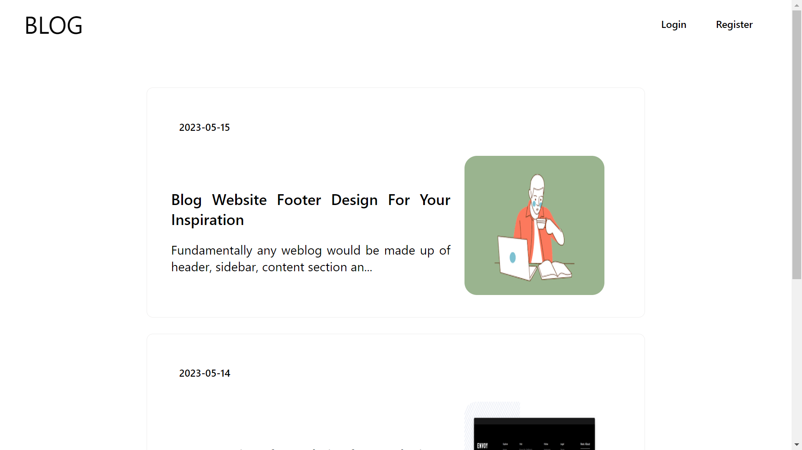
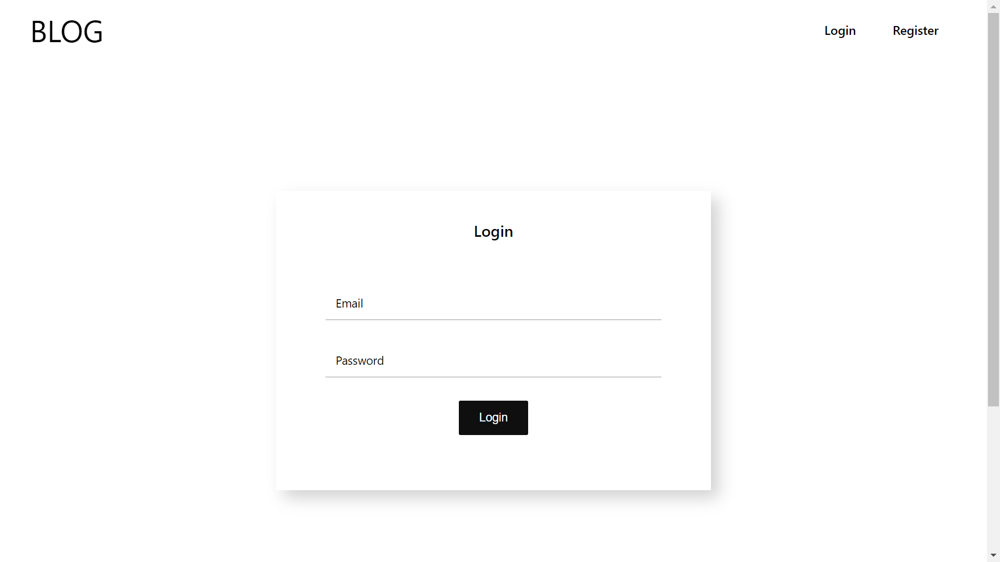
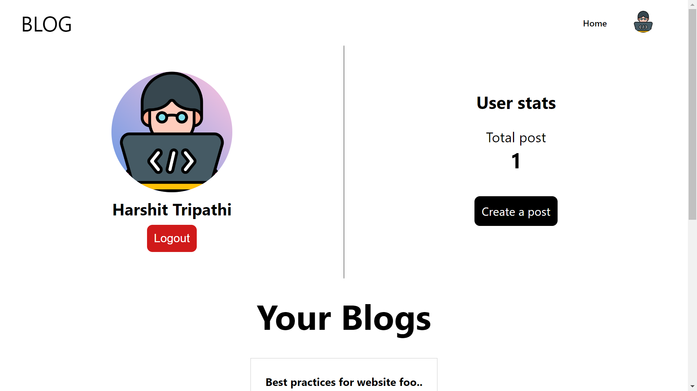
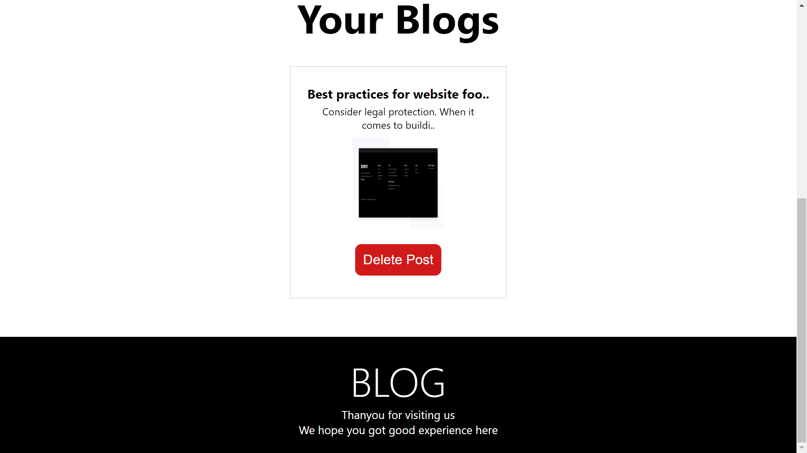
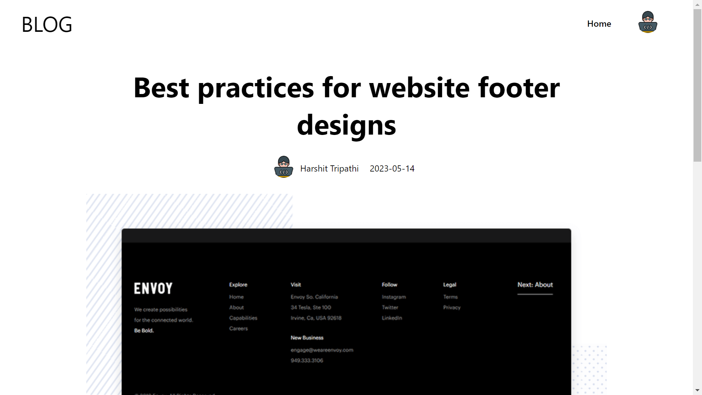
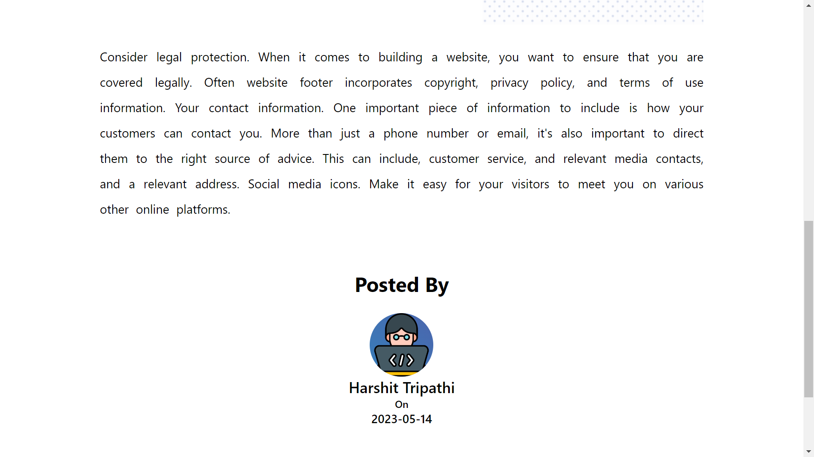

## Blog App
This is a blog app where user can create and upload blog and read blogs of other users.
#### Tech stack
This app uses Nodejs and ExpressJs in backend and MongoDb for data storage.

React and Css for frontend

### UI of the app
**Home Page**

**Login Page**

**User Dashboard**

**Blog Page**

